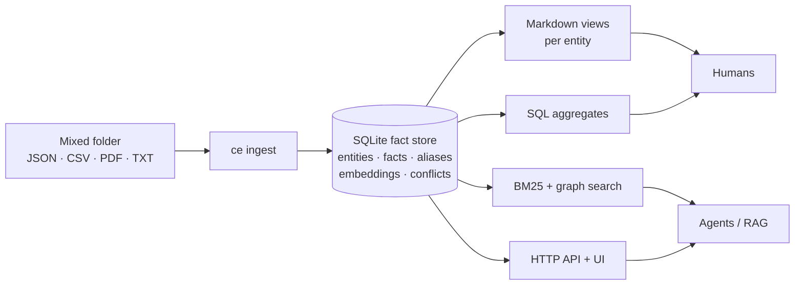
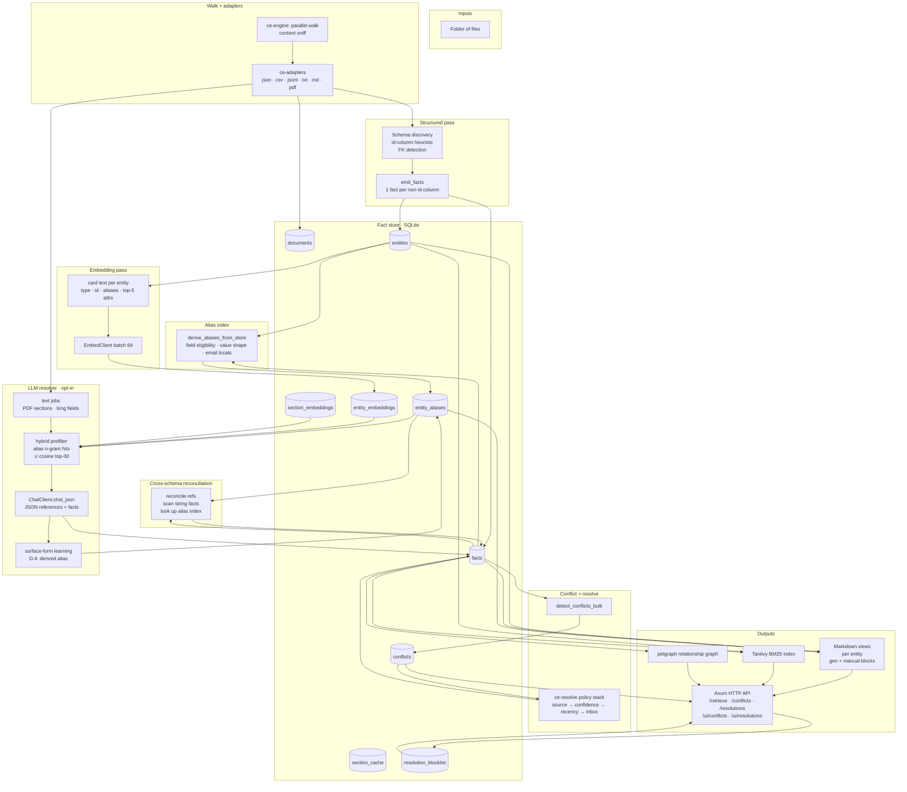
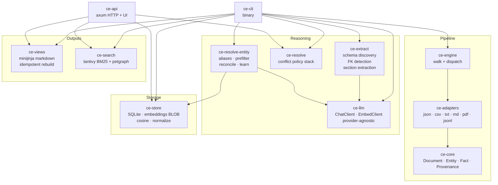
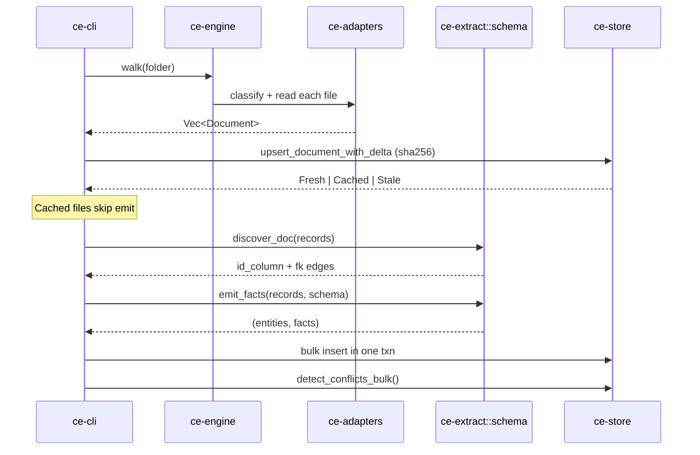
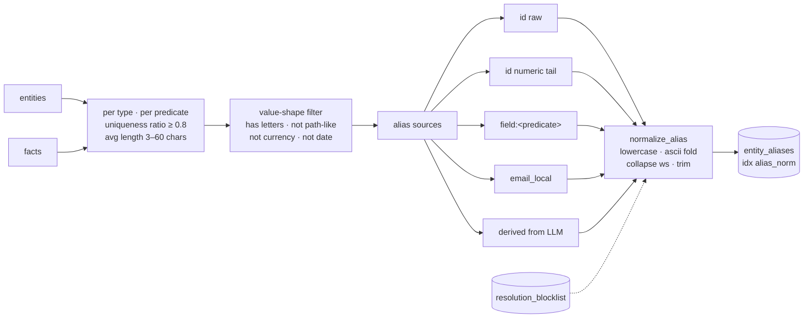
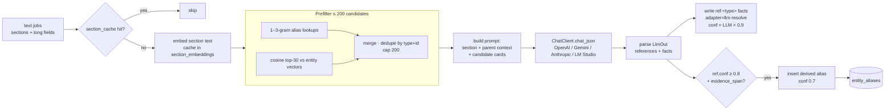
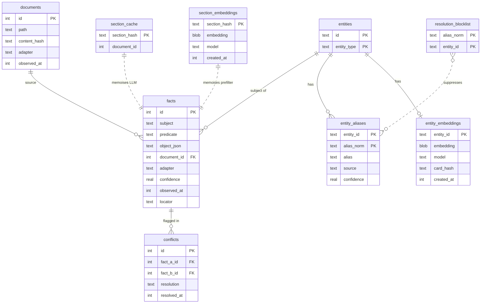
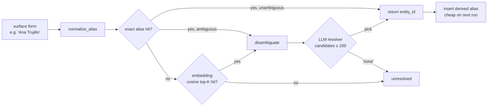
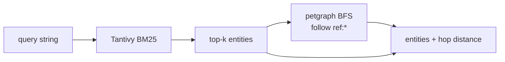
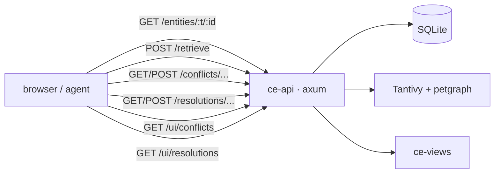

# Context Engine (`ce`)

> Turn a folder of messy enterprise data — JSON, CSV, PDFs, plain text, emails, chats — into a queryable knowledge graph of **entities** and **facts**, with conflict detection, AI-driven entity resolution, Markdown views, and hybrid search. All in one Rust binary, all schema-agnostic.

---

## Table of contents

1. [The problem](#1-the-problem)
2. [The solution at a glance](#2-the-solution-at-a-glance)
3. [End-to-end flow](#3-end-to-end-flow)
4. [Core concepts](#4-core-concepts)
5. [Architecture & crates](#5-architecture--crates)
6. [The pipeline in depth](#6-the-pipeline-in-depth)
7. [Storage model](#7-storage-model)
8. [Entity resolution: alias → embed → LLM](#8-entity-resolution-alias--embed--llm)
9. [Conflict detection & resolution](#9-conflict-detection--resolution)
10. [Markdown views](#10-markdown-views)
11. [Search & retrieval](#11-search--retrieval)
12. [HTTP API & UI](#12-http-api--ui)
13. [Setup & configuration](#13-setup--configuration)
14. [CLI reference](#14-cli-reference)
15. [End-to-end example](#15-end-to-end-example)
16. [Design rules & non-goals](#16-design-rules--non-goals)
17. [Known limitations](#17-known-limitations)

---

## 1. The problem

Real organisations don't keep their knowledge in one tidy database. It's spread across:

- **Structured exports** — CSV / JSON dumps from CRM, HR, ticketing.
- **Semi-structured records** — emails, chats, support transcripts (have headers, have free-form bodies).
- **Pure prose** — PDFs of policies, invoices, reports, plain text notes.

The same entity (say, customer **ALFKI**) shows up under different names ("Alfki Trading Co.", "Alfki", `alfki`), in fields named differently across sources (`customer_id` here, `client` there), and gets *referenced by name* in email bodies and PDFs. Two sources will disagree about the same fact. Nothing is consistent.

If you want an LLM agent — or a human — to reason over all of this, you need a single, queryable substrate that:

- preserves where every fact came from (provenance),
- links mentions across files even when names drift,
- flags disagreements rather than silently picking one,
- doesn't require a hand-written schema for every dataset.

That's what `ce` builds.

---

## 2. The solution at a glance



`ce` is one Rust workspace that ships a single `ce` CLI binary. Pointed at any folder it:

1. **Walks** every file, sniffs content, dispatches to an adapter.
2. **Discovers structure** in record-shaped files: heuristically picks the id column per schema, detects foreign-key edges between schemas.
3. **Emits facts** with full provenance (path, locator, adapter, confidence, timestamp) into SQLite.
4. **Builds an alias index**: for every entity, every plausible name / id-variant becomes a lookup key.
5. **Embeds** each entity (and each text section) into a vector, cached in SQLite as a BLOB.
6. **Reconciles cross-schema references** — values like "Alfki Trading Co." in one file resolve to entity `ALFKI` in another, via alias lookup.
7. **Optionally runs an LLM resolver** over prose: hybrid prefilter (alias hits ∪ embedding-cosine top-K) shortlists candidates, the LLM picks the right one, the picked surface form is learned back into the alias index.
8. **Auto-detects conflicts** (same `(subject, predicate)`, different `object`) and resolves them via a deterministic policy stack with a human inbox for ties.
9. **Renders Markdown views** per entity with idempotent `<!-- ce:generated -->` and preservable `<!-- ce:manual -->` blocks.
10. **Indexes** entities into Tantivy (BM25) and exposes a graph walk over `ref:*` facts.
11. **Serves** an HTTP API + minimal web UI for retrieval, conflict review, and resolution approval.

The whole thing is **generic over data shape** — no field name, no entity type, no schema is hardcoded. Detection is statistical (uniqueness ratios, value-shape regex, alias-hit rates), never by name list.

---

## 3. End-to-end flow



The same picture in plain words: walk → adapt → discover → emit → alias → embed → reconcile → (LLM resolve) → conflict-detect → resolve → render / index / serve.

---

## 4. Core concepts

| Concept | Meaning |
|---|---|
| **Document** | Bookkeeping row for every ingested file (or LLM section), with content hash. Drives delta re-ingest. |
| **Entity** | `{ id: String, entity_type: String }`. The id comes from the discovered id column; type is the schema name (folder + file basename). PDFs become entities of synthetic type `document`. |
| **Fact** | `{ subject, predicate, object, provenance }`. One row per non-id column for structured records; LLM-extracted facts pull predicates from the prose. |
| **Predicate `ref:<type>`** | A graph edge. The object is the id of an entity of `<type>`. Everything without this prefix is a plain attribute. |
| **Provenance** | Source path + locator (`row=12`, `page=3`, byte span), adapter name, confidence (`1.0` for structured, lower for LLM-derived), observation timestamp. |
| **Alias** | Any string that should resolve to a given entity: the id, derived id-variants (strip prefixes / leading zeros), name-shaped fields, email local-parts, humanised names, and surface forms learned by the LLM resolver. |
| **Conflict** | Two facts with the same `(subject, predicate)` but different `object_json`. Detected automatically. |
| **Resolution** | A decision (deterministic policy or human click) about which side of a conflict wins, recorded as `prefer:<fact_id>`. Losers are soft-deleted (`confidence=0`), never hard-deleted (because `conflicts.fact_a_id` is a foreign key). |

---

## 5. Architecture & crates



| Crate | Responsibility |
|---|---|
| `ce-core` | Pure domain types: `Document`, `Record`, `Entity`, `Fact`, `Provenance`, `SourceRef`, the `Adapter` trait. No I/O. |
| `ce-adapters` | Built-in `Adapter` implementations for `json`, `jsonl`, `csv`, `txt`, `md`, `pdf`. New formats drop in via the trait. |
| `ce-engine` | Parallel directory walker (`ignore` crate, respects `.gitignore`), content sniffer, adapter dispatch. |
| `ce-extract` | Schema discovery (id column + FK detection), long-text-field detection, LLM-driven section extraction (delegates to `ce-llm`). |
| `ce-store` | SQLite migrations + CRUD, embeddings BLOB helpers, `cosine`, `normalize_alias`, fact insert with auto-conflict detection. |
| `ce-resolve` | Single-fact conflict resolver — deterministic stack (source priority → confidence → recency → inbox). |
| `ce-resolve-entity` | Entity-resolution: alias derivation, hybrid prefilter, cross-schema reconciliation, LLM resolver glue, surface-form learning loop. |
| `ce-llm` | Provider-agnostic `ChatClient` + `EmbedClient`. Implementations for OpenAI-compatible (covers OpenAI, OpenRouter, LM Studio), Gemini, Anthropic. Loads `LlmConfig` from `ce.toml` or env vars. |
| `ce-views` | Markdown rendering with `minijinja`. Idempotent: `<!-- ce:generated -->` blocks rewritten, `<!-- ce:manual -->` blocks preserved. Includes `## Aliases`, `## Outgoing references`, `## Referenced by` sections. |
| `ce-search` | Tantivy index over entities (BM25) + petgraph relationship graph built from `ref:*` facts; supports k-hop expansion. |
| `ce-api` | Axum HTTP API + static HTML pages for `/ui/conflicts` and `/ui/resolutions`. |
| `ce-cli` | The `ce` binary. Orchestrates the full pipeline; every phase is also an independent subcommand. |

Each crate has a small, stable surface and is independently usable as a library.

---

## 6. The pipeline in depth

`ce ingest <folder>` runs phases 1–3 (structured + alias + reconcile) by default, plus phase 5 (LLM resolver) when `--max-llm N > 0`. Phase 4 (embeddings) is a separate command because it can be expensive and is reusable across providers.

### Phase 1 — Structured pass



- **Walk**: `ignore`-based, respects `.gitignore`, parallel I/O.
- **Sniff**: extension + magic bytes pick the adapter.
- **Delta**: each file's SHA-256 content hash is stored alongside its document row. On re-run, unchanged files are skipped (`cached`), modified files have prior facts (and dependent conflicts) deleted before re-emit (`stale`), new files (`fresh`) are ingested.
- **Schema discovery (per `Records` document)**:
  - Pick id column heuristically: `id`, `<schema>_id`, `<schema>Id`, or any `*id`-named column with unique values.
  - Detect FK edges: sample 20 values per non-id column, look for ≥50% overlap with id-sets of other schemas. Same-schema edges skipped.
  - Long-text detection: any string field ≥200 chars in ≥50% of rows is flagged as a candidate for LLM extraction.
- **Emit**: one fact per non-id column. FK columns get the `ref:<type>` predicate; everything else stays as the raw column name.
- **Synthetic `document` entity**: PDF/TXT files get one entity of type `document` so the LLM resolver has a parent subject to attach `ref:` edges to.
- **Bulk conflict detect**: a self-join over `facts` flags `(subject, predicate)` collisions. Skipped automatically when no new facts were inserted (it's N², would hang otherwise).

### Phase 2 — Alias index



Generic detection of alias-shaped fields without ever naming `name`, `full_name`, etc. — high uniqueness ratio + sensible value length + value-shape filter.

### Phase 3 — Cross-schema reconciliation

For every non `ref:*` string fact, look the value up in the alias index. If it points unambiguously to one entity of a *different* type, emit a `ref:<that_type>` fact with `adapter='alias-reconcile'`, confidence = `alias_conf × 0.9`. This is what fixes "Alfki Trading Co." (in the orders CSV) → `ALFKI` (the customer entity), without writing a single dataset-specific rule.

### Phase 4 — Embeddings

Per entity, build a generic *card text*:

```
<type> <id>
aliases: a1, a2, ...
<predicate1>: <short value>
<predicate2>: <short value>
...   (top 5 attribute facts, sorted by value length asc, total cap 2048 chars)
```

Sorting facts by length puts identifying short attributes (status, role, country) at the top and pushes out long bodies. Hash the card; stale = `card_hash` mismatch OR `model` mismatch. Idempotent re-runs.

`EmbedClient::embed_batch` (provider-agnostic) returns 768-dim f32 vectors stored as little-endian BLOBs. Throughput against local LM Studio + nomic-embed: ~165 entities/sec.

### Phase 5 — LLM resolver (opt-in via `--max-llm N`)



Key properties:

- **Hybrid prefilter** keeps the prompt short and accurate. The LLM never sees more than 200 candidates and gets the type, top aliases, and a few distinguishing attributes for each.
- **Constrained JSON output** — strict shape `{ references: [...], facts: [...] }`. `references` may include `null` if the LLM thinks none of the candidates fit (no hallucinated ids).
- **Surface-form learning (D.4)**: when the LLM confidently maps `"Ravi"` → `emp_1002`, the surface is stored as a `derived` alias at confidence 0.7. Future runs catch the same surface without an LLM call. Closed feedback loop → fewer LLM calls over time.
- **Caching**: per-section SHA-256 in `section_cache` makes re-runs free.
- **Bounded cost**: `--max-llm N` caps how many sections enter the queue; `--llm-concurrency M` caps parallelism (LM Studio local: 2–4; cloud: dozens).

---

## 7. Storage model

Two migration files: `crates/ce-store/migrations/0001_init.sql` and `0002_aliases_embeddings.sql`. Both run on every `Store::open`.



- **`facts(subject, predicate)` is indexed** — that's the hot path for conflict detection and graph queries.
- **Embeddings are little-endian f32 BLOBs**. `embedding_to_blob` / `embedding_from_blob` / `cosine` live in `ce-store`.
- **Soft delete only**: `conflicts.fact_a_id` references `facts(id)`, so resolved-against facts get `confidence = 0` rather than being dropped. List endpoints filter `confidence > 0`.
- **`source`** on `entity_aliases` is one of `id`, `field:<predicate>`, `email_local`, `derived` — useful for auditing in the markdown `## Aliases` section.

---

## 8. Entity resolution: alias → embed → LLM

The whole point: link mentions across files even when names drift. Three layers, each cheaper than the next:



Why three layers:

| Layer | Catches | Cost |
|---|---|---|
| Alias n-gram lookup | exact / normalised matches, id variants, name fields, email locals | µs |
| Embedding cosine top-K | semantic neighbours ("Bangalore office" → city entity, "support agent who handled this" → employee) | ms |
| LLM disambiguation | name collisions, paraphrased mentions, ambiguous shorthands | seconds |

Surface-form learning means the LLM is only paid for *novel* surfaces. The same mention in a future document is caught by the alias index for free.

---

## 9. Conflict detection & resolution

```mermaid
flowchart LR
    F1[fact A:<br/>subject=alfki<br/>predicate=country<br/>object='Mexico'<br/>adapter=csv conf=1.0]
    F2[fact B:<br/>subject=alfki<br/>predicate=country<br/>object='México'<br/>adapter=llm conf=0.6]
    F1 --> D[detect_conflicts_bulk]
    F2 --> D
    D --> C[(conflicts row)]
    C --> P[ce resolve · policy stack]
    P --> S1{source priority<br/>csv 100 · json 100<br/>pdf 50 · txt 50<br/>llm 20}
    S1 -- decisive --> WIN[prefer fact A<br/>fact B → confidence=0]
    S1 -- tie --> S2{confidence ≥ 0.7?}
    S2 -- decisive --> WIN
    S2 -- tie --> S3{newest observed_at}
    S3 -- decisive --> WIN
    S3 -- tie --> INBOX[/ui/conflicts<br/>human picks]
    INBOX --> WIN
```

The losing fact's row stays — only `confidence` drops to 0. The conflict row gets `resolution = "prefer:<id>"` and a timestamp. Re-running `ce resolve` is idempotent.

---

## 10. Markdown views

`ce build --out out` writes one Markdown file per entity at `out/<entity_type>/<id>.md`.

```markdown
---
id: emp_1002
type: employees
last_generated: 2026-04-26T05:42:00Z
source_count: 3
---

<!-- ce:generated:start -->

## Attributes

- **name**: Ravi Kumar  _(csv@1.0)_
- **role**: Software Engineer  _(csv@1.0)_
- **department**: Platform  _(csv@1.0)_

## Aliases

- `Ravi Kumar` (field:name)
- `ravi.kumar` (email_local)
- `Ravi` (derived)

## Outgoing references

- → [reports_to · emp_0099](../employees/emp_0099.md)  _(csv@1.0)_

## Referenced by

- ← [emails/email_4711](../emails/email_4711.md) · ref:employees  _(llm-resolve@0.81)_

<!-- ce:generated:end -->

<!-- ce:manual:start -->
Stammkunde, bevorzugt Telefonkontakt morgens.
<!-- ce:manual:end -->
```

- **Idempotent**: every rebuild rewrites `ce:generated` blocks byte-for-byte stable; `ce:manual` blocks survive untouched.
- **Custom templates**: pass `--templates <dir>` and any `<entity_type>.md` (Jinja syntax) overrides the default. Unrecognised types fall back to the built-in template.
- The same content backs the HTTP API's `/entities/{type}/{id}` endpoint, so what a human reads in their editor is what an agent gets back from `ce serve`.

---

## 11. Search & retrieval

`ce index` builds a Tantivy index — one document per entity with fields `id`, `entity_type`, `text` (id + type + every predicate + every fact value, tokenised).

`ce search "<query>"` runs BM25. With `--hops N`, top hits become seeds for a BFS over the relationship graph (built from `ref:*` facts via `petgraph::DiGraphMap`); related entities are returned with their hop distance.



The `POST /retrieve` HTTP endpoint exposes the same: `{"query":"refund policy","k":10,"hops":1}`.

> Embeddings are present and used for the LLM-resolver prefilter, but the public search path is BM25 + graph hops only. Adding semantic search on top is a one-function extension on `ce-search` (the entity vectors are right there in `entity_embeddings`).

---

## 12. HTTP API & UI



| Route | Method | Purpose |
|---|---|---|
| `/` | GET | Index page linking to inboxes |
| `/health` | GET | Liveness `ok` |
| `/entities/:type/:id` | GET | Facts + rendered Markdown JSON |
| `/retrieve` | POST | BM25 + optional graph hops |
| `/conflicts`, `/conflicts/:id`, `/conflicts/:id/resolve` | GET / GET / POST | Conflict inbox backend |
| `/resolutions` | GET | LLM-resolved refs filtered by confidence ceiling, excludes already-suppressed (conf=0) entries |
| `/resolutions/approve` | POST | Promotes the surface→entity pair to a `derived` alias at confidence 1.0 |
| `/resolutions/reject` | POST | Adds `(alias_norm, entity_id)` to `resolution_blocklist`; soft-deletes the offending fact |
| `/ui/conflicts` | GET | Static HTML conflict reviewer (vanilla JS, side-by-side, keep-A / keep-B) |
| `/ui/resolutions` | GET | Static HTML resolutions reviewer (approve / reject) |

---

## 13. Setup & configuration

### Build

```bash
cargo build --release
```

### LLM provider config

`ce.toml` at the repo root is auto-loaded from the current working directory. Override per command with `--llm-config <path>`.

```toml
[llm]
provider     = "lmstudio"        # lmstudio | openai | openrouter | gemini | anthropic
base_url     = "http://127.0.0.1:1234/v1"
model        = "google/gemma-4-26b-a4b"
embed_model  = "text-embedding-nomic-embed-text-v1.5"
api_key      = "lm-studio"       # LM Studio ignores the value
concurrency  = 4
max_retries  = 3
timeout_secs = 300               # gemma 26B locally needs minutes
```

Switching to Gemini is a one-line change:

```toml
[llm]
provider     = "gemini"
model        = "gemini-2.5-flash-lite"
embed_model  = "gemini-embedding-001"
api_key      = "<your-key>"
concurrency  = 16
```

Env-var fallbacks: `CE_LLM_PROVIDER`, `CE_LLM_MODEL`, `CE_LLM_EMBED_MODEL`, `CE_LLM_BASE_URL`, `CE_LLM_API_KEY`, plus per-provider `OPENROUTER_API_KEY` / `OPENAI_API_KEY` / `GEMINI_API_KEY` / `ANTHROPIC_API_KEY`.

`ce llm-test` round-trips a one-shot prompt against the configured provider — sanity check before anything heavy.

---

## 14. CLI reference

All commands accept `--store <path>` (default `ce.sqlite`).

| Command | What it does |
|---|---|
| `ce ingest <folder> [--max-llm N] [--llm-concurrency M] [--llm-config PATH] [--llm-model M] [--dry-run]` | Full pipeline. `--max-llm 0` (default) runs structured + alias + reconcile only. |
| `ce alias-index [--rebuild]` | Re-derive aliases standalone. |
| `ce reconcile-refs [--confidence-discount 0.9]` | Cross-schema ref reconciliation standalone. |
| `ce embed [--llm-config] [--batch-size 64] [--force] [--limit N]` | Run / refresh entity embeddings against the configured `embed_model`. |
| `ce llm-test [--prompt …]` | One-shot round-trip to verify the configured provider. |
| `ce inspect conflicts` | List unresolved conflicts with both fact metas. |
| `ce inspect resolutions [--since TS] [--limit N]` | Read-only audit of LLM-resolver decisions with quoted evidence spans. |
| `ce resolve` | Apply the policy stack to every unresolved conflict. |
| `ce build [--out out] [--templates DIR]` | Render Markdown views. |
| `ce index [--idx ce.idx]` | Build the Tantivy index. |
| `ce search "<query>" [--k 10] [--hops 1] [--idx ce.idx]` | BM25 search + optional graph expansion. |
| `ce serve [--addr 127.0.0.1:3000] [--idx ce.idx]` | Start the HTTP API + UI. |
| `ce list <type> [--contains S] [--limit N]` | Browse entities by type. |
| `ce show <type> <id> [--format md\|json\|facts]` | Show one entity. `md` includes the `## Aliases` section. |
| `ce agg entity-counts \| predicate-counts \| top-values <pred>` | Templated SQL aggregates over the fact table. |

A `justfile` wraps the common combinations (`just ingest`, `just build-views`, `just index`, `just serve`, `just all`, etc.).

---

## 15. End-to-end example

Smallest end-to-end pass on a fresh checkout, against the bundled `EnterpriseBench/` corpus:

```bash
# 0. Build
cargo build --release

# 1. Provider sanity (needs LM Studio reachable, or any other configured provider)
cargo run -q -p ce-cli -- llm-test --prompt 'reply with {"ack":true}'

# 2. Structured + alias + reconcile (no LLM yet)
just ingest                          # ce ingest ./EnterpriseBench

# 3. Look at it
just agg-counts
cargo run --release --quiet -p ce-cli -- agg top-values ref:customers --limit 10

# 4. Re-ingest is a no-op (delta)
just ingest                          # fresh=0 cached=N stale=0

# 5. Embed everything (~3 min for 33k entities on local nomic-embed)
cargo run -q -p ce-cli -- embed --batch-size 64

# 6. LLM resolver pass on a few sections
RUST_LOG=info,ce_llm=debug \
  cargo run -q -p ce-cli -- ingest EnterpriseBench --max-llm 5 --llm-concurrency 2

# 7. Resolve any conflicts deterministically; review the rest in the UI
cargo run -q -p ce-cli -- inspect conflicts
cargo run -q -p ce-cli -- resolve

# 8. Render the Markdown source-of-truth tree
just build-views
ls out/                              # clients customers emails employees ...

# 9. Build a search index and query it
just index
just search "wireless adapter" 5 1

# 10. Serve the API + UI
just serve                           # then open http://127.0.0.1:3000/
```

Verify in SQLite:

```bash
sqlite3 -header -column ce.sqlite "
SELECT 'entities', count(*) FROM entities
UNION ALL SELECT 'facts', count(*) FROM facts
UNION ALL SELECT 'aliases', count(*) FROM entity_aliases
UNION ALL SELECT 'entity_embeddings', count(*) FROM entity_embeddings
UNION ALL SELECT 'reconciled_refs', count(*) FROM facts WHERE adapter='alias-reconcile'
UNION ALL SELECT 'llm-resolve_refs', count(*) FROM facts WHERE adapter='llm-resolve' AND confidence>0
UNION ALL SELECT 'derived_aliases', count(*) FROM entity_aliases WHERE source='derived'
UNION ALL SELECT 'document_entities', count(*) FROM entities WHERE entity_type='document'
UNION ALL SELECT 'blocked', count(*) FROM resolution_blocklist;"
```

For consumption by an agent:

```bash
curl -s -X POST http://127.0.0.1:3000/retrieve \
  -H 'content-type: application/json' \
  -d '{"query":"refund policy","k":10,"hops":1}'
```

For consumption by a human: open `out/<type>/` in any Markdown editor — same content as the API, but readable and editable in the `<!-- ce:manual -->` block.

---

## 16. Design rules & non-goals

**Hard project-wide rule: no schema-specific code.** Detection is statistical (uniqueness ratios, value-shape regex, alias-hit rates) or LLM-confirmed for borderline cases. The hardcoded literals that *are* allowed are ones owned by `ce` itself: the `ref:` predicate prefix, the `document` meta-type for synthesised entities, and adapter strings (`llm`, `llm-resolve`, `alias-reconcile`). Lists like `["name", "Name", "full_name"]` are not.

Other deliberate constraints:

- **No HNSW.** Brute-force cosine over ≤100 k entities is fine.
- **No Postgres.** Single-binary SQLite for portability.
- **No graph database wrapper.** `petgraph` + SQLite is enough.
- **No OCR.** Scanned PDFs are out of scope.
- **No NL-to-SQL.** Aggregates go through templates; risky free-form SQL deferred.
- **Idempotent Markdown.** Two builds in a row produce byte-identical `<!-- ce:generated -->` blocks.

---

## 17. Known limitations

- A handful of files in the EnterpriseBench corpus (`tasks.jsonl`, `posts.json`, `GitHub.json`, `overflow.json`) lack any `*id`-shaped column and yield 0 entities. Add an explicit `--id-col` hint or pre-process to add one if you need them indexed.
- FK detection samples 20 values per column at ≥50% overlap. Numeric columns like `Age` or `Score` can produce spurious `ref:*` facts; visible in the graph but easy to filter out.
- Self-referential FKs (e.g. `reports_to: emp_*`) are skipped — same-schema edges are excluded by the FK detector for now. The cross-schema reconciler (Phase F) covers most real cases.
- The LLM pass needs a configured provider and is bounded by `--max-llm`. Local large models (gemma 26B) take 30–70 s per call; cloud providers (Gemini, OpenAI) are seconds.
- Public retrieval is BM25 + graph hops only. Semantic search on top of `entity_embeddings` is a small follow-up.
- Hard-deleting an `llm-resolve` fact fails because of the `conflicts.fact_a_id` foreign key — the suppression path uses `confidence = 0` instead, and list endpoints filter `confidence > 0`.

---

## Project documents

- **`README.md`** (this file) — comprehensive overview.
- **`EnterpriseBench/`** — bundled test corpus (~1.3k files, ~33k entities).
